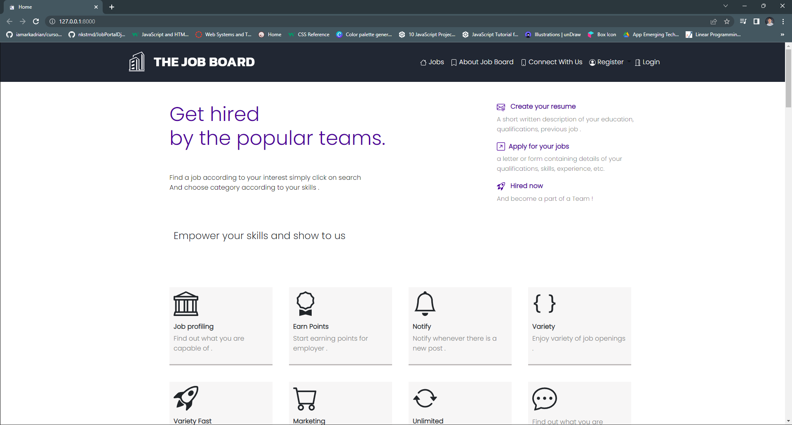
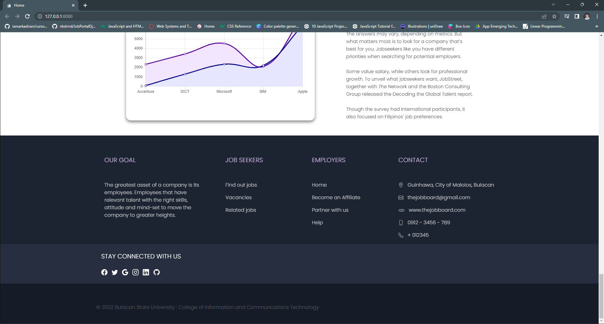
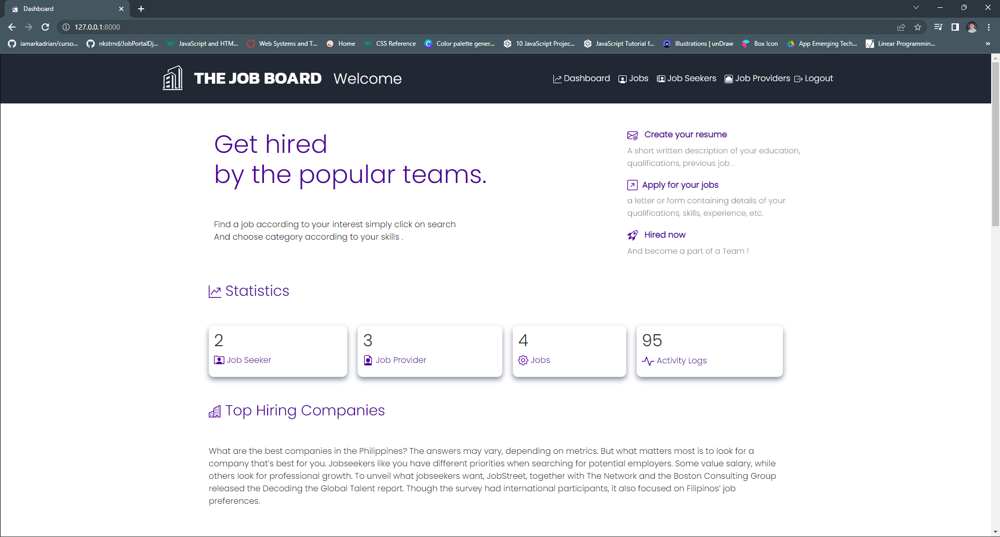
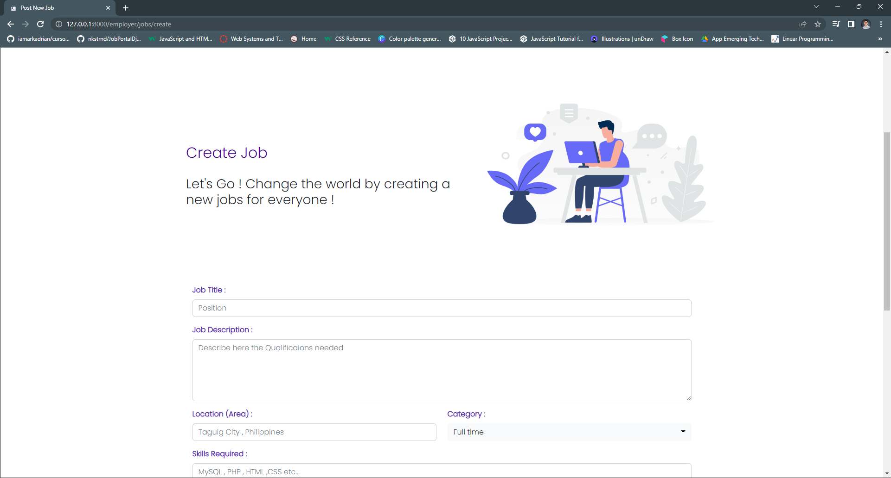
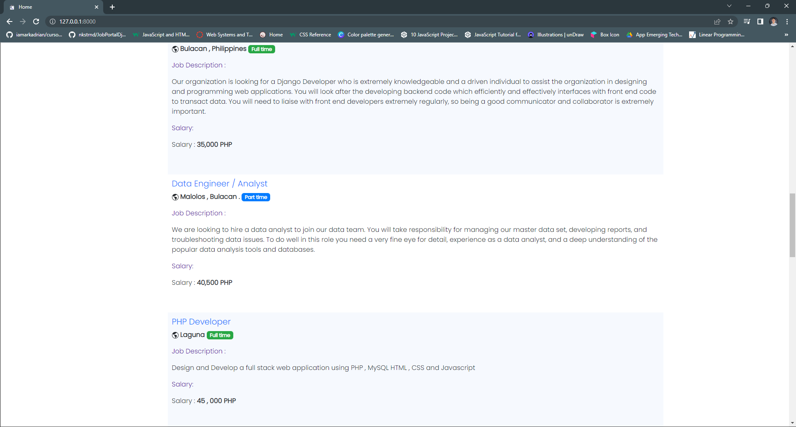
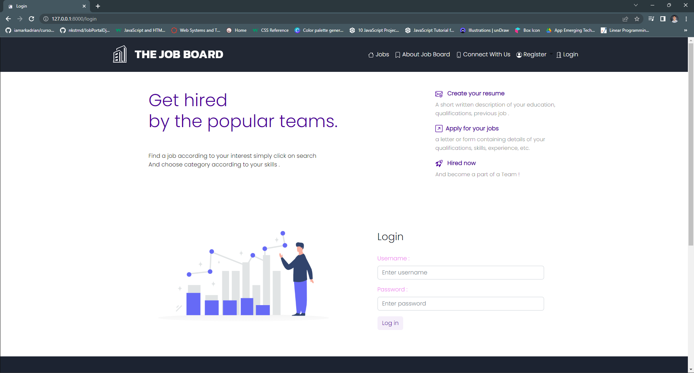
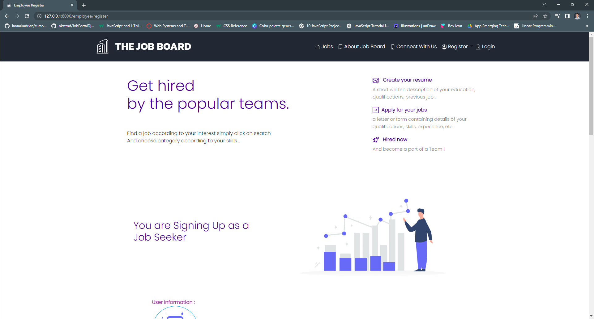
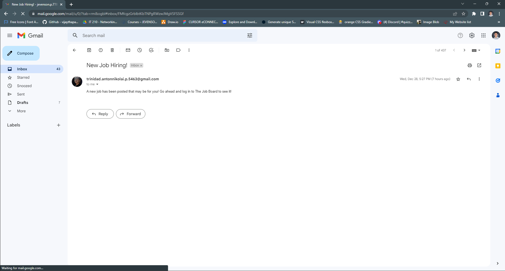

### Group 2 Elective 5  WEB 3 Final Project : Django Job Portal 

 To create an online job portal web app for a job seeker (student) and job provider (company). The Student or Job seeker can easily find and apply ##for a job by login into the system. The Employer or company can easily get an expert employee from our job portal site by posting a job. Maximize the use of the Python Django web framework that you learned in this course.

### Group Members :
     1. CADAG , Jonkyiel Lagriada
     2. DUMLAO , Jonathan Gulliod
     3. GATCHALIAN , Eimereen Cruz
     4. HILARIO , Leofert Santiago
     5. LOPEZ , Maria Celyn Alberto
     6. MONEDERO , Russel Jaime Malapit
     7. PEÑAS, Jevenson Paring
     8. REYES, Nicole Andrei Salvador
     9. TRINIDAD , Anton Nikolai Posadas

### Main Page : 

### Footer :

### Admin Page : 

### Job Publishing : 
 

### Jobs : 
 

### Login : 
 

### Account Registration : 
  

### Email Notification : 
  

